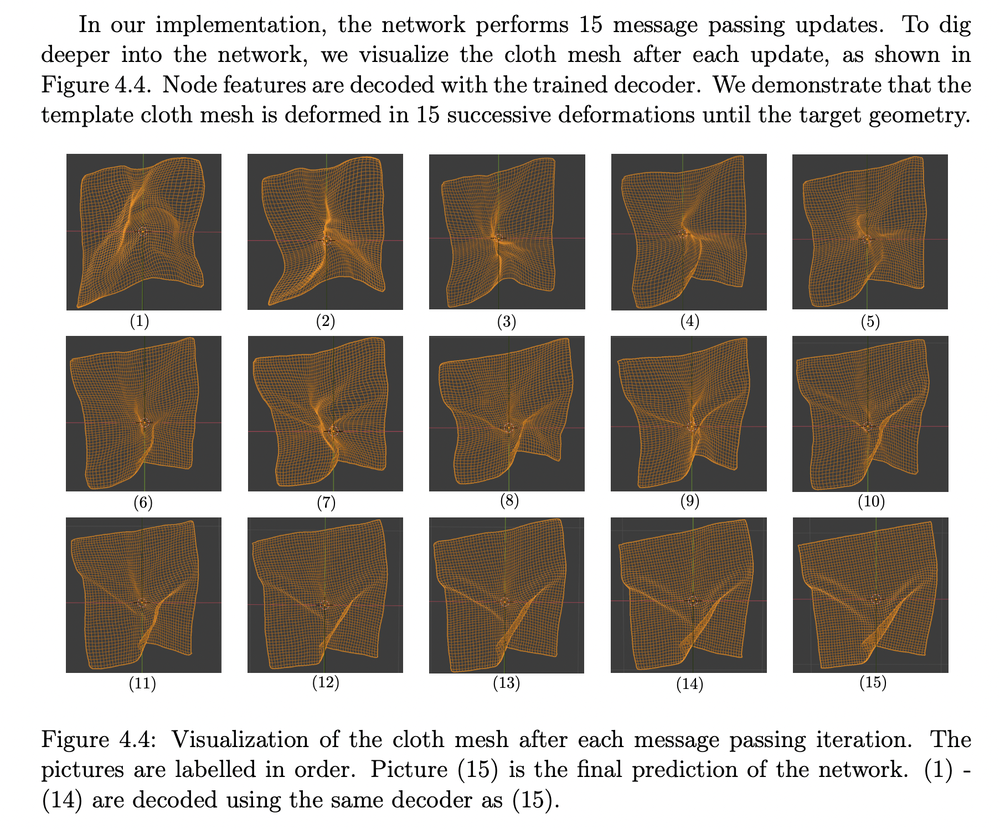
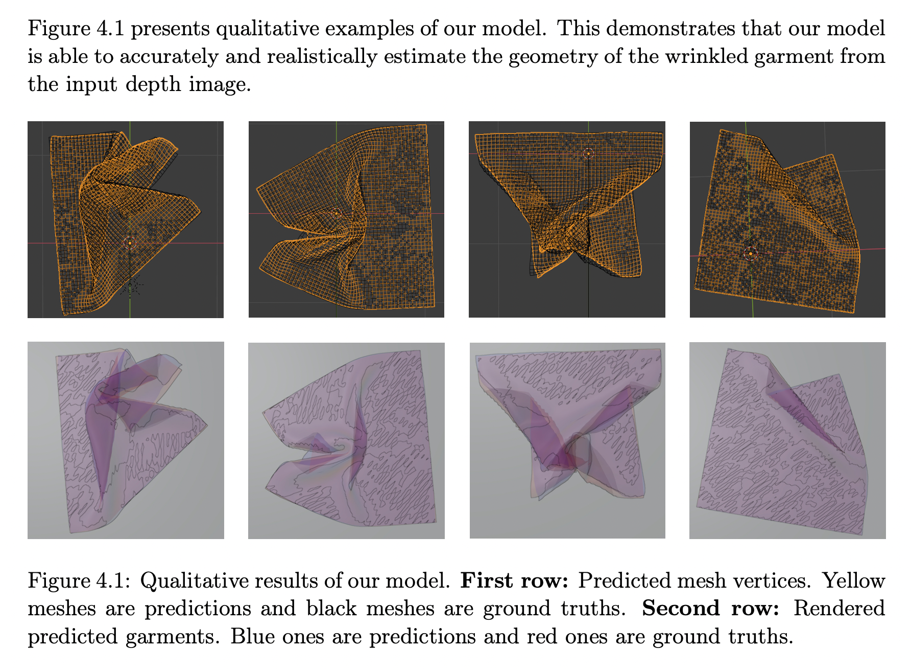
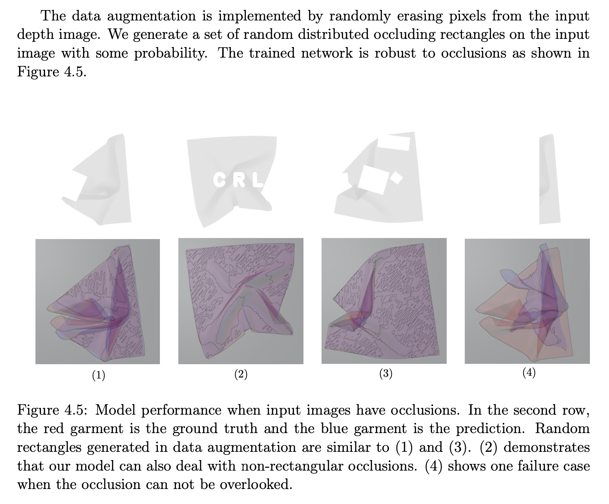

# Learning of Geometry Estimation for Wrinkled Garments

My semester project at ETH Zurich. 

This task is to reconstruct the geometry of a wrinkled garment/deformed cloth using a single-view depth simulated image.

The idea of using Graph Neural Network to model the deformed cloth is inspired by MeshGraphNets: https://arxiv.org/pdf/2010.03409.pdf

The idea of using template-based deformation to model the geometry estimation of wrinkled garments is inspired by https://arxiv.org/abs/1905.03244.

Part of the code is adapted from the pytorch implementation of meshgraphnets from https://github.com/wwMark/meshgraphnets.

## method overview


## deformation (message passing) visualization


## qualitative visualization


## data augmentation for occlusion



## code for training a new model:
```
python main.py
```

## code for test a model:
```
python main.py --phase=test --pt_file=./experiments/exp_288759_resnet34_edge_no_image_feature_attention/bestmodel_0189_0.0082321205.pt

```
### modify parameters according to your needs
